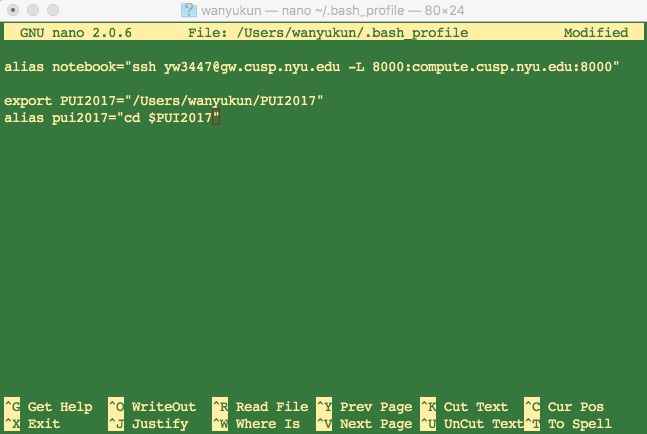

# PUI2017_yw3447

**Steps to set up the enviornment:**
1. Create a local directory called PUI2017 under /User/wanyukun
2. Enter file ~/.bash_profile
3. Create enviornment variable 'PUI2017' to point to this directory
4. Create alias 'pui2017' to jump to this directory

5. Save and exit
6. Use command 'pwd', 'pui2017' and 'pwd' to verify the setting

